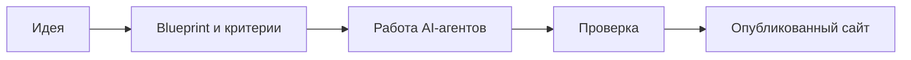
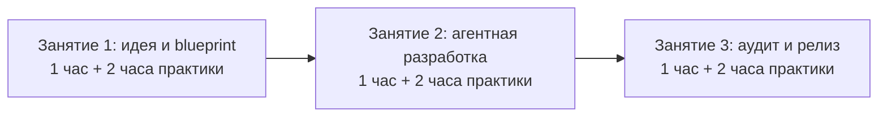
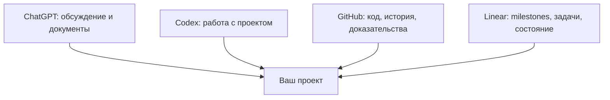
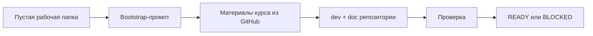
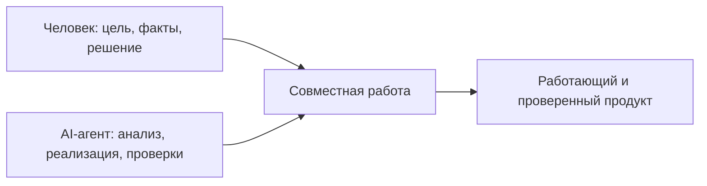

# Перед первым занятием

## AI-native Web Product 01: от идеи до работающего сайта

**Dobrovola AI Native Lab**  
Авторская методика Сергея Авдейчика

**Время на материал:** 15-20 минут чтения и 30-60 минут технической подготовки.  
**Результат подготовки:** рабочая среда, карточка идеи и статус `READY`.

> Этот файл можно читать самостоятельно или загрузить в ChatGPT и попросить помочь пройти подготовку. Готовый промпт находится в конце документа.

---

## 1. Что произойдёт на курсе

За три занятия вы создадите первую версию сайта компании, услуги, проекта или курса. Это будет не только красивая страница: сайт должен объяснять ценность, принимать заявку и доводить посетителя до следующего действия, например записи на встречу.



Главная цель курса - не изучить все возможности веб-разработки. За девять часов это невозможно. Цель - освоить **повторяемый процесс**, с помощью которого вы сможете дальше развивать свой продукт.

После курса вы должны уметь сказать:

> Я могу сформулировать задачу, передать крупный этап AI-агентам, проверить результат и выпустить рабочую версию продукта.

---

## 2. Как устроены девять часов

Каждый этап состоит из одного часа общей работы в Google Meet и двух часов самостоятельной практики сразу после встречи.



### Занятие 1

Вы уточняете идею, выбираете одного основного пользователя, одно предложение ценности и одно целевое действие. Затем превращаете обсуждение в blueprint, тексты и критерии приёмки.

### Занятие 2

Вы создаёте рабочий контур проекта в Linear и GitHub. Руководитель получает milestone целиком, формирует крупные поручения, а исполнитель автономно реализует рабочий пакет и готовит отчёт.

### Занятие 3

Независимый аудитор проверяет продукт. Критические дефекты исправляются, сайт публикуется, а студент самостоятельно проводит ещё одно изменение через весь цикл.

**Важно:** заранее зарезервируйте после каждой встречи ещё два часа. Если отложить практику на несколько дней, большая часть учебного эффекта потеряется.

---

## 3. Четыре основных инструмента



### ChatGPT - партнёр по формулированию

С ним вы обсуждаете аудиторию, проблему, ценность, границы первой версии и тексты. ChatGPT помогает структурировать мысли, но не должен придумывать факты, клиентов, отзывы или гарантии.

### Codex - агент, работающий с проектом

Codex читает файлы проекта, анализирует код, создаёт и изменяет файлы, запускает команды и готовит отчёт. Он может действовать как руководитель, исполнитель или аудитор - в зависимости от прямой команды пользователя и инструкций проекта.

### GitHub - память и доказательства

В GitHub хранятся код, документация и история изменений. По commits и pull requests можно увидеть, что именно было сделано, когда и кем.

### Linear - рабочая карта проекта

В Linear фиксируются milestones, крупные поручения, блокеры, критерии и состояние работы. Это не система автоматической оценки людей. Это общее рабочее пространство человека и агентов.

---

## 4. Что остаётся за человеком, а что можно поручить агенту

| Человек отвечает за | AI-агент помогает |
|---|---|
| Цель продукта | Исследовать варианты реализации |
| Правдивость фактов | Структурировать blueprint и документы |
| Границы и приоритеты | Анализировать код и зависимости |
| Разрешения и риски | Писать и изменять код |
| Проверку результата | Запускать тесты и сборку |
| Финальное решение | Готовить отчёты и доказательства |

Основное правило курса:

> Сообщение агента «готово» ещё не означает, что работа действительно готова.

Результат подтверждают работающий сценарий, diff, commit или PR, тесты, скриншоты, публичная ссылка и проверка человеком.

---

## 5. Что нужно подготовить до первого занятия

### 5.1. ChatGPT и Codex

1. Убедитесь, что можете войти в свой аккаунт ChatGPT.
2. Проверьте, что вам доступен Codex.
3. Базовый рекомендуемый вариант курса - приложение ChatGPT для компьютера с доступом к локальной папке проекта.
4. Опытные пользователи могут работать через Codex CLI или расширение для IDE, но интерфейс не должен мешать выполнению общей методики.

Официальное руководство OpenAI:  
<https://developers.openai.com/codex/quickstart>

### 5.2. GitHub и Git

1. Создайте личный аккаунт GitHub.
2. Подтвердите адрес электронной почты.
3. Установите Git.
4. Для автоматической настройки рекомендуется установить GitHub CLI.

Проверка в терминале:

```bash
git --version
gh --version
gh auth status
```

Если GitHub CLI ещё не авторизован:

```bash
gh auth login
```

Никому не отправляйте пароль, access token или код двухфакторной авторизации.

Официальные ссылки:

- создание аккаунта: <https://docs.github.com/en/account-and-profile/how-tos/account-management/creating-an-account-on-github>
- установка Git: <https://docs.github.com/en/get-started/git-basics/set-up-git>
- GitHub CLI: <https://cli.github.com/>

### 5.3. Linear

1. Создайте аккаунт Linear.
2. Создайте личное учебное workspace или войдите в предоставленное преподавателем.
3. Убедитесь, что можете создать тестовую issue.

Начальное руководство: <https://linear.app/docs/start-guide>

### 5.4. Google Meet

До занятия проверьте микрофон, наушники, демонстрацию экрана и возможность одновременно открыть Meet, ChatGPT/Codex, GitHub и Linear.

---

## 6. Автоматическая подготовка проекта

Вам не нужно вручную создавать все папки, роли и skills. Это сделает Codex по готовой инструкции.



Перед запуском используйте пустую папку, выберите короткое имя проекта латиницей, прочитайте промпт и не вставляйте секреты.

### Bootstrap-промпт

```text
Ты - агент подготовки рабочей среды курса Dobrovola AI Native Lab.

Источник материалов:
https://github.com/sergeionlyart/dobrovola-ai-lab.git

Профиль курса:
courses/01-web-product-foundation

Переменные:
PROJECT_SLUG=<короткое латинское имя проекта>
PROJECT_TITLE=<понятное название проекта>
WORKSPACE_DIR=<текущая пустая рабочая папка>

Цель: подготовить локальную рабочую зону, не начиная разработку продукта.

1. Проверь, что рабочая папка не содержит важных файлов. Ничего не удаляй и не перезаписывай без моего явного разрешения.
2. Во временную папку клонируй публичный репозиторий курса. Не копируй его каталог .git.
3. Создай две папки: PROJECT_SLUG_dev для разработки и PROJECT_SLUG_doc для документации.
4. В dev-папку перенеси содержимое каталога starter, включая скрытые .codex и .agents.
5. В doc-папку перенеси шаблоны из templates.
6. Инициализируй в обеих папках отдельные Git-репозитории и создай начальные commits.
7. Если GitHub CLI авторизован, создай два приватных репозитория с теми же именами и отправь commits. Не запрашивай и не показывай токены.
8. Проверь Git, Codex и структуру файлов. Не начинай разработку сайта и не выбирай технологический стек.
9. В конце выдай статус READY или BLOCKED.

В отчёте укажи созданные папки, результат git status, удалённые репозитории, выполненные проверки, найденные проблемы и следующий ручной шаг.
```

`READY` означает, что локальная структура создана, Git работает и обязательные файлы находятся на месте. `BLOCKED` означает, что подготовка не завершена; агент должен указать точную причину и следующий шаг.

Полная актуальная версия пакета промптов: <https://github.com/sergeionlyart/dobrovola-ai-lab/blob/main/courses/01-web-product-foundation/PROMPTS.md>

---

## 7. Подготовьте карточку идеи

До занятия ответьте на семь вопросов. Достаточно одного-двух предложений на каждый пункт.

1. **Что я создаю?** Например, сайт консультационной услуги.
2. **Для кого?** Не «для всех», а для одного понятного типа пользователя.
3. **Какую проблему решаю?** Какую неудобную, дорогую или медленную ситуацию человек хочет изменить?
4. **Какую ценность предлагаю?** Что станет проще, быстрее, дешевле или надёжнее?
5. **Какое одно действие должен совершить посетитель?** Оставить заявку, записаться на консультацию или запросить демонстрацию.
6. **Почему он может мне доверять?** Реальный опыт, кейс, квалификация или прозрачный процесс. Не придумывайте доказательства.
7. **Что точно не входит в первую версию?** Например, личный кабинет, оплаты, сложная CRM, AI-support и многоязычность.

### Слишком широкая идея

> Сделать современную AI-платформу для всех предпринимателей.

### Идея, подходящая для курса

> Сделать одностраничный сайт для владельцев малых компаний, которым нужна консультация по автоматизации одного рабочего процесса. Посетитель понимает предложение, оставляет заявку и получает возможность выбрать время встречи.

Шаблон карточки: <https://github.com/sergeionlyart/dobrovola-ai-lab/blob/main/courses/01-web-product-foundation/templates/project-card.md>

---

## 8. Что не нужно изучать до первого занятия

Пока не устанавливайте и не осваивайте Figma, Google Cloud, Vercel, базы данных, платёжные системы, сложные frontend-фреймворки и настройку множества AI-моделей.

Эти темы важны, но сейчас они будут отвлекать от основного навыка: **поставить цель, организовать работу агентов и проверить законченный результат**.

---

## 9. Мини-словарь

**Репозиторий** - папка проекта с историей изменений, обычно хранящаяся в GitHub.

**Blueprint** - понятное описание продукта: для кого он, что делает, как работает и где проходят его границы.

**Scope** - утверждённый объём работы. Всё, что не входит в него, не должно появляться «заодно».

**Milestone** - крупный законченный этап проекта с наблюдаемым результатом.

**Commit** - зафиксированный набор изменений с понятным названием.

**Pull request, PR** - предложение включить изменения в основную версию проекта после проверки.

**Руководитель** - агент, отвечающий за milestone целиком: постановку крупных поручений, контроль и приёмку.

**Исполнитель** - агент, автономно выполняющий крупный рабочий пакет и передающий доказательный отчёт руководителю.

---

## 10. С чем нужно прийти на первое занятие

- [ ] Я вошёл в ChatGPT и вижу Codex.
- [ ] Git установлен: команда `git --version` работает.
- [ ] Аккаунт GitHub создан, email подтверждён.
- [ ] GitHub CLI установлен и авторизован либо я зафиксировал этот пункт как блокер.
- [ ] Аккаунт Linear создан, тестовая issue открывается.
- [ ] Bootstrap завершён со статусом `READY` или есть точный отчёт `BLOCKED`.
- [ ] Карточка идеи заполнена.
- [ ] Я выбрал одно основное действие посетителя.
- [ ] Я зарезервировал два часа практики после занятия.

Преподавателю передаются название проекта и `PROJECT_SLUG`, карточка идеи, отчёт bootstrap-агента, ссылки на dev/doc-репозитории и точный текст ошибки при статусе `BLOCKED`.

---

## 11. Как использовать этот Markdown-файл в ChatGPT

Загрузите файл в отдельный чат и отправьте промпт:

```text
Прочитай приложенный материал подготовки к курсу AI-native Web Product 01.

Твоя задача - помочь мне подготовиться, а не выполнить курс вместо меня.

1. Сначала кратко перескажи материал простым языком.
2. Спроси, какая у меня операционная система и какие инструменты уже установлены.
3. Проводи меня по подготовке по одному шагу за раз.
4. Объясняй непонятные термины на примерах.
5. Не проси пароли, токены, коды двухфакторной авторизации и другие секреты.
6. Не утверждай, что инструмент работает, пока я не покажу результат проверки.
7. Помоги заполнить карточку проекта, задавая критические уточняющие вопросы.
8. В конце сформируй чек-лист и один статус: READY или BLOCKED.

При статусе BLOCKED укажи точную причину и следующий конкретный шаг.
```

---

## 12. Главное перед стартом

Вам не нужно заранее знать программирование, устройство backend или облачную инфраструктуру. Но нужно быть готовым ясно объяснять идею, читать результаты агента, не подтверждать непонятные действия вслепую, проверять факты и рабочий результат, честно фиксировать блокеры и выделять время на практику.



**Курс начинается не с кода. Он начинается с ясной цели и подготовленной рабочей среды.**

---

## Официальные источники

Ссылки проверены 2 сентября 2026 года.

1. OpenAI Codex Quickstart: <https://developers.openai.com/codex/quickstart>
2. OpenAI Codex CLI: <https://developers.openai.com/codex/cli>
3. OpenAI Codex IDE extension: <https://developers.openai.com/codex/ide>
4. GitHub: создание аккаунта: <https://docs.github.com/en/account-and-profile/how-tos/account-management/creating-an-account-on-github>
5. GitHub: установка Git: <https://docs.github.com/en/get-started/git-basics/set-up-git>
6. GitHub CLI: <https://cli.github.com/>
7. Linear Start Guide: <https://linear.app/docs/start-guide>
8. Публичные материалы курса: <https://github.com/sergeionlyart/dobrovola-ai-lab>

---

**Версия:** 0.1, материал для первого пилота  
**Автор:** Сергей Авдейчик / Dobrovola  
**Проект:** Dobrovola AI Native Lab
